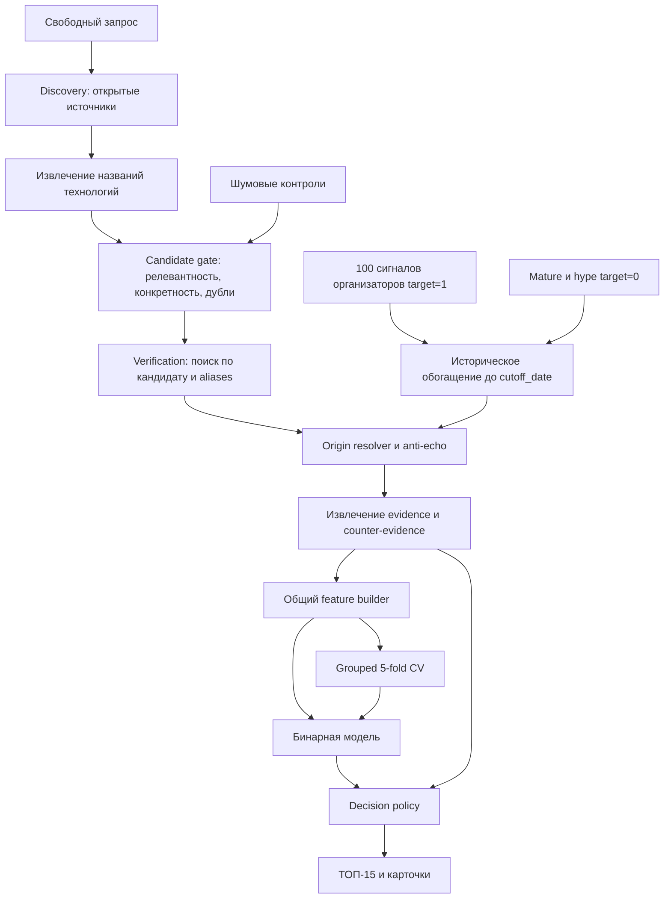

# Архитектура

## Основные решения

1. Классифицируется технологический кандидат, а не документ.
2. Информационный шум фильтруется до бинарной модели и оценивается отдельно.
3. Организаторские, отрицательные и новые кандидаты используют один исторический feature builder.
4. Все признаки рассчитываются только по материалам, опубликованным до даты среза.
5. DOI, патентный идентификатор и цепочка происхождения важнее числа URL.
6. Модель, проверка зрелости и Evidence Duel являются отдельными этапами.
7. Неизвестное значение не заменяется нулём и не доказывает новизну.
8. Существенное утверждение связано с документом и фрагментом.

## Поток данных

## Источники MVP

Первая версия использует небольшой набор устойчивых интеграций:

- [OpenAlex](https://help.openalex.org/api/) — поиск научных работ, метаданные, авторские организации и группировка по годам;
- [Crossref](https://www.crossref.org/documentation/retrieve-metadata/rest-api/) — проверка DOI, канонических названий и дат публикации; запись Crossref не считается независимым доказательством, если тот же DOI уже получен из OpenAlex;
- [GDELT DOC](https://blog.gdeltproject.org/gdelt-doc-2-0-api-debuts/) — discovery отраслевых материалов и отдельная динамика информационного поля.

Патентный коннектор не входит в критический путь квалификационного релиза. Патент из проверяемого открытого URL может использоваться как evidence, но массовая патентная аналитика добавляется после квалификации.

OpenAlex служит основным количественным корпусом. GDELT даёт отдельный информационный ряд и не смешивается с числом научных публикаций. Crossref уточняет метаданные и помогает дедупликации.

Каждый коннектор имеет timeout, ограниченное число повторов, локальный кэш ответа и собственный статус. Частичный отказ создаёт предупреждение и `unknown` в зависимых признаках, а не нулевое значение.

## Discovery и формирование кандидатов

Discovery нормализует пользовательский запрос в версионируемый `analysis_scope`, затем получает недавние документы по его русским и английским вариантам. Scope фиксируется до извлечения кандидатов и служит общим знаменателем временной динамики. Кандидаты извлекаются из тем, ключевых слов, названий и аннотаций. Базовый путь использует метаданные источника и правила для терминов; языковая модель может предложить структурированный вариант названия, но не является обязательной.

Candidate gate проверяет:

- семантическую связь с запросом;
- наличие конкретного технического механизма или применения;
- отсутствие общих понятий, организаций и рекламных утверждений вместо технологии;
- совпадение с уже найденным кандидатом.

После gate выполняется verification search по каноническому имени и aliases. Это отделяет первоначальное обнаружение названия от сбора доказательств.

## Происхождение документов

`origin_id` определяется в следующем порядке:

1. нормализованный DOI;
2. идентификатор патента или стандарта;
3. canonical URL;
4. ссылка на исходный материал из документа;
5. кластер близких заголовков одного события с учётом даты и издателя.

Текстовая близость без совпадения события не объединяет независимые исследования. Решение origin resolver сохраняет использованные правила и уверенность. Число документов, URL, первоисточников и организаций хранится раздельно.

## Доменные сущности

### SourceDocument

Документ хранит:

- идентификатор коннектора и устойчивый внешний идентификатор;
- оригинальное название, URL и canonical URL;
- DOI, патентный или иной идентификатор при наличии;
- дату публикации и время получения;
- тип, язык, издателя и уровень доверенности;
- авторов и организации при наличии;
- исходный фрагмент или аннотацию;
- `origin_id`;
- отметки перевода и генеративного резюме;
- версию snapshot.

### EvidenceClaim

Одно проверяемое утверждение содержит:

- тип: исследование, патент, прототип, пилот, инвестиция, внедрение, стандарт, рынок или рекламное заявление;
- направление `support` или `counter`;
- текст утверждения;
- идентификатор документа, фрагмент и locator;
- дату и организацию;
- уверенность автоматического извлечения;
- статус ручной проверки для демонстрационного кейса.

### Candidate

Кандидат содержит:

- каноническое название и aliases;
- исходный запрос и область;
- идентификатор и версию `analysis_scope`;
- связанные документы, origin groups и evidence;
- дату среза;
- `group_id`;
- версии discovery, нормализации и snapshot.

### FeatureVector

FeatureVector разделён на группы:

| Группа | Признаки MVP |
| --- | --- |
| Релевантность | Сходство кандидата с запросом, конкретность объекта |
| Временное покрытие | Статус двух годовых окон, число датированных наблюдений |
| Рост | Доля темы в направлении по окнам, изменение доли, отдельные ряды по источникам |
| Новизна | Первая найденная дата, возраст темы, появление новой комбинации терминов |
| Связность | Независимые организации, устойчивость терминологии и активности |
| Evidence | Независимые origin groups, типы и уровни доверенности источников |
| Зрелость | Массовое внедрение, рынок, стандарт, выраженные лидеры |
| Anti-echo | Доля перепечаток, копий и материалов одного origin |
| Текст | Компактное представление названия и автоматически найденных материалов |

Признаки строятся одной версионируемой функцией. Fit-зависимые преобразования текста обучаются отдельно внутри каждого fold.

## Историческое обогащение

Для обучающей строки используются только каноническое название, проверенные aliases, исходное направление и дата среза. Организаторские объяснение, стадия, тренд, балл и приложенные ссылки не участвуют в поисковом запросе feature builder.

Для каждого количественного источника выполняются два запроса:

1. кандидат по каноническому имени и aliases;
2. зафиксированный `analysis_scope` для нормализующего знаменателя.

Результаты раскладываются по двум годовым окнам из `REQUIREMENTS.md`. Нулевой результат допустим только при успешном ответе коннектора и ненулевом знаменателе scope. История получения, запрос, параметры, ответ и checksum сохраняются. Все кандидаты одного анализа используют один scope; чувствительность демонстрационного результата к ширине scope проверяется отдельно.

## Модель

Модельный корпус состоит из 100 положительных сигналов и минимум 100 сопоставимых отрицательных кандидатов `mature` и `marketing_hype`. Шум не участвует в основной бинарной метрике.

Последовательность экспериментов:

1. majority baseline;
2. rule-based baseline;
3. Logistic Regression на структурированных признаках;
4. Logistic Regression с компактными текстовыми признаками;
5. более сложная модель только при устойчивом улучшении на тех же folds.

В отчёте используется одно out-of-fold предсказание на строку. Порог выбирается внутри обучающих частей. Финальная модель обучается на всём проверенном бинарном корпусе после фиксации feature version, алгоритма и порога.

`model_score` находится в диапазоне `[0, 1]`, но не называется вероятностью без проверки калибровки. Порядковое место в ТОП-15 не является отдельным прогнозом успеха: кандидаты `main` сортируются по зафиксированному `model_score`, затем по качеству независимых доказательств и стабильному идентификатору для разрешения равенства.

## Decision policy

Decision policy не обучается скрыто. Она применяет явные правила в фиксированном порядке:

1. результат Candidate gate;
2. критические признаки зрелости;
3. маркетинговая волна без независимого технического основания;
4. полнота истории и минимальное число независимых origin groups;
5. модельный порог;
6. формирование статуса и кода причины.

В `main` допускается кандидат с двумя независимыми origin groups, двумя организациями и хотя бы одним источником уровня A или B. Неполный, но содержательный кандидат получает `watchlist`. Подтверждённая зрелость имеет приоритет над сильным ростом упоминаний.

## Evidence Duel

Evidence builder группирует утверждения по направлениям `support` и `counter`. Шаблон объяснения использует только сохранённые claims и значения признаков. Если утверждение не связано с документом, оно помечается как аналитическая гипотеза и не влияет на обязательные пороги.

LLM допускается для извлечения структурированных claims, перевода и краткого резюме. Результат проверяется по схеме, ссылкам и исходным фрагментам. LLM не определяет итоговый статус и не создаёт даты, компании, кейсы или метрики без источника.

## Исторический срез

Исторический сценарий выполняется тем же конвейером с прошлым `cutoff_date`. SQL-запросы и feature builder фильтруют документы по `published_at <= cutoff_date`. Документы без даты могут пояснять термин, но не участвуют во временных признаках и не подтверждают раннее обнаружение.

Результат среза сохраняется до просмотра последующих событий. Поздние документы отображаются отдельным слоем проверки.

## Хранение

PostgreSQL интегрированной версии хранит:

- snapshots запросов и ответы коннекторов;
- документы и цепочки происхождения;
- кандидатов и aliases;
- evidence claims;
- feature vectors;
- версии модели и оценки;
- analyses, статусы и причины исключения.

Большие тексты и модельные файлы могут храниться вне базы с checksum и ссылкой. Демонстрационный in-memory backend остаётся отдельным UI-каркасом и не считается реализацией этого контура.

## Отказоустойчивость и воспроизводимость

- повторный запрос с тем же snapshot не загружает документы повторно;
- каждый коннектор изолирован и имеет ограничение времени;
- частичный результат содержит список недоступных источников;
- сохранённый snapshot обрабатывается детерминированно одной версией кода;
- live-повтор может получить новые документы и поэтому создаёт новый snapshot;
- лог не содержит ключей API и полных закрытых текстов.
