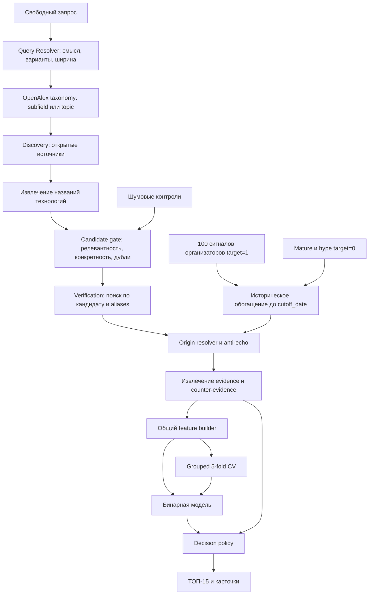
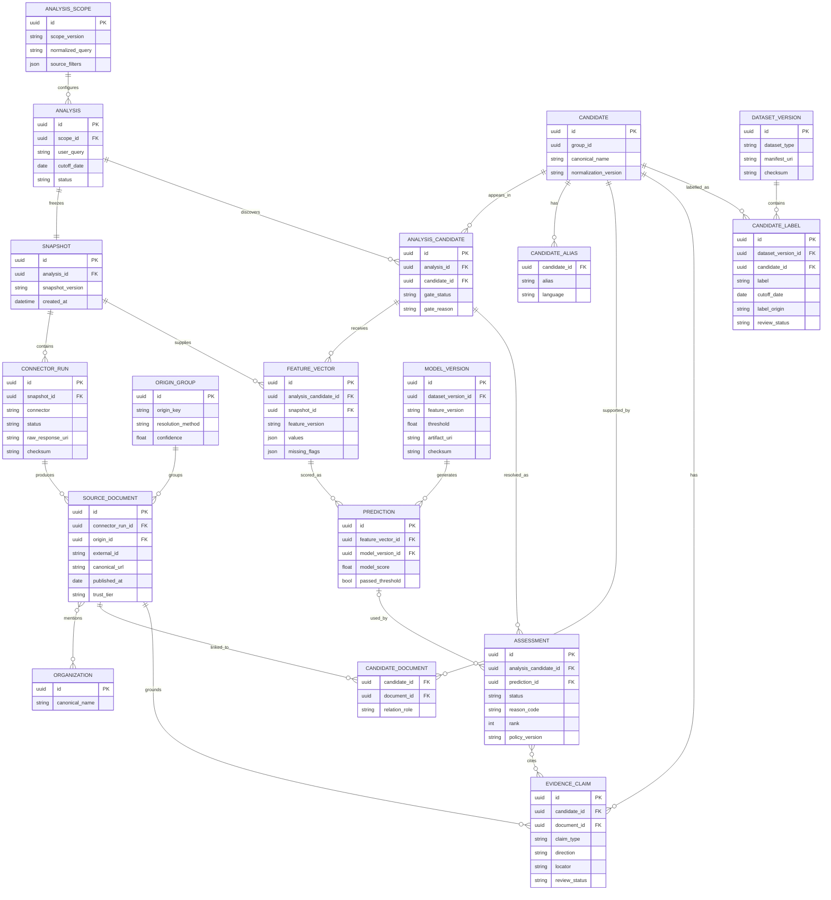
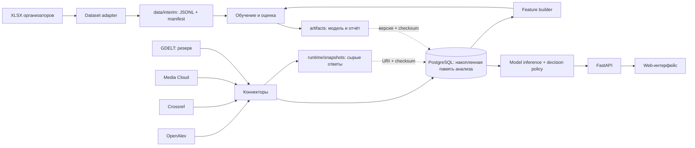

# Архитектура

## Основные решения

1. Классифицируется технологический кандидат, а не документ.
2. Информационный шум фильтруется до бинарной модели и оценивается отдельно.
3. Организаторские, отрицательные и новые кандидаты используют один исторический feature builder.
4. Все признаки рассчитываются только по материалам, опубликованным до даты среза.
5. DOI, патентный идентификатор и цепочка происхождения важнее числа URL.
6. Модель, проверка зрелости и Evidence Duel являются отдельными этапами.
7. Неизвестное значение не заменяется нулём и не доказывает новизну.
8. Существенное утверждение связано с документом и фрагментом.

## Поток данных

## Источники MVP

Внешние API используются как удалённые поисковые индексы в момент анализа. NextWave не выгружает весь OpenAlex и не формирует до релиза локальный корпус по тысячам произвольных тем.

- [OpenAlex](https://help.openalex.org/api/) — обязательный источник discovery научных работ, метаданных, авторских организаций и нормированной динамики публикаций;
- [Crossref](https://www.crossref.org/documentation/retrieve-metadata/rest-api/) — точечное обогащение уже найденных DOI: проверка канонического названия, издателя и дат. Crossref не используется как второй массовый discovery-поиск;
- [Media Cloud](https://www.mediacloud.org/documentation/search-api-guide) — вспомогательный международный новостной индекс для поиска сообщений о пилотах, внедрениях, инвестициях и продуктах; [GDELT DOC](https://blog.gdeltproject.org/gdelt-doc-2-0-api-debuts/) остаётся резервным адаптером. Этот контур не является самостоятельным основанием слабого сигнала, а недоступность обоих информационных провайдеров не останавливает научный поиск.

Патентный коннектор не входит в критический путь квалификационного релиза. Патент из проверяемого открытого URL может использоваться как evidence, но массовая патентная аналитика добавляется после квалификации.

OpenAlex служит основным количественным научным источником. Media Cloud даёт отдельный нормированный ряд международной новостной активности; GDELT может заполнить этот контур при доступности. Новостная динамика не смешивается с числом научных публикаций, не компенсирует отсутствие технических доказательств и не определяет итоговый класс самостоятельно. Запись Crossref не считается независимым доказательством, если тот же DOI уже получен из OpenAlex.

Поисковые выдачи используются для discovery, а не как количественная метрика. Семантические, тематические и текстовые результаты OpenAlex объединяются только для обнаружения кандидатов. Количественная динамика рассчитывается отдельными фиксированными запросами: по доле кандидата внутри области OpenAlex, по `count-over-time` Media Cloud и, при резервном обращении к GDELT, по `TimelineVolRaw`. Количество записей на загруженной странице и сырое отношение числа новостей к числу научных работ не являются признаками модели.

Каждый коннектор имеет timeout, ограниченное число повторов, локальный кэш сырого ответа и собственный статус. Частичный отказ создаёт предупреждение и `unknown` в зависимых признаках, а не нулевое значение.

Квалификационная сборка обращается к Media Cloud в реальном времени и не требует локального новостного корпуса. Временный отзываемый token хранится в приватном репозитории отдельно от кода и автоматически передаётся только backend-контейнеру. Web-клиент, параметры URL, логи и snapshots token не получают. После оценки token отзывается; публичная версия репозитория публикуется без него.

### Стратегия доступа к данным

Каждый новый анализ текущего состояния выполняется в таком порядке:

1. Система фиксирует `analysis_scope`, дату среза и жёсткий бюджет запросов, страниц и документов для каждого источника.
2. PostgreSQL возвращает ранее обработанные документы, кандидатов и origin groups, релевантные этому scope. Они уменьшают повторную работу, но не заменяют проверку свежести.
3. OpenAlex выполняет ограниченный live-discovery. Для повторного или близкого запроса система также проверяет свежую дельту; достаточное локальное покрытие не является причиной пропустить этот шаг.
4. Новые и сохранённые документы объединяются по устойчивым идентификаторам, после чего candidate gate формирует короткий список технологий.
5. Verification search выполняется только для кандидатов короткого списка. Crossref вызывается точечно для DOI с отсутствующими или противоречивыми метаданными. Доступный информационный коннектор добавляет контекст внедрения и информационной активности.
6. В локальное хранилище попадают только документы, origin groups, evidence и сырые ответы, реально использованные в анализе. Новый запуск создаёт новый snapshot.

Исключение — явное воспроизведение исторического snapshot: оно не обращается к live-источникам, потому что должно повторить зафиксированный результат. Обычный повтор текущего запроса всегда создаёт проверку свежести. Точный кэш запроса нужен для повторной обработки и защиты от временных сбоев API, а не для объявления локальной базы полной копией внешнего источника.

## Discovery и формирование кандидатов

Query Resolver отделяет формулировку пользователя от запроса к источнику. Структурированный интерпретатор возвращает каноническую английскую формулировку, проверенные варианты поиска, языки и ширину намерения: `direction` для области или `technology` для конкретной технологии. Его JSON проходит строгую схему; он не выбирает кандидатов и не вызывает источники самостоятельно. Для русскоязычного запроса перевод обязателен: проверка OpenAlex показала, что прямой семантический поиск по русскому тексту может давать тематически ошибочную выдачу.

Затем resolver сверяет каноническую формулировку с таксономией OpenAlex. Широкая область сопоставляется с `subfield`, а конкретная технология — с `topic`. Связь принимается только при полном лексическом покрытии запроса и отсутствии неоднозначности. Например, `ИИ` и `Технологии в ИИ` получают общий scope `artificial intelligence` и `subfield=1702`; специализированная тема вроде `Artificial Intelligence in Healthcare` не подменяет широкое направление. Если уверенного соответствия нет, taxonomy-фильтр не назначается: текстовый и семантический поиск продолжают работать по канонической английской формулировке. Ошибка taxonomy API сохраняется как `unavailable`, а не как пустая выдача.

После разрешения запроса Discovery получает недавние документы по зафиксированным вариантам. Scope фиксируется до извлечения кандидатов и служит общим знаменателем временной динамики. Каждый источник имеет собственный адаптер извлечения, но возвращает общий `CandidateMention`: возможное название, `document_id`, коннектор, тип поля и точный locator. OpenAlex topics и keywords дополнительно сохраняют provider ID и score; текстовые извлекатели работают с названиями, аннотациями и новостными заголовками. Упоминание ещё не считается технологией.

`DiscoveryPipeline` параллельно запускает OpenAlex и информационный executor. Media Cloud выполняет отдельные ограниченные запросы для каждого языка scope. Если набор коллекций не задан backend-конфигурацией, используется глобальный индекс с теми же лимитами документов, страниц и времени. GDELT запускается только при отсутствии ключа Media Cloud, отсутствии основного коннектора в плане или полном отсутствии успешных ответов Media Cloud. Успешный ответ с нулём материалов является известным нулём и не вызывает fallback. При fallback GDELT ArtList получает только последние три календарных месяца, поскольку это ограничение данного endpoint; фактическое окно сохраняется в параметрах запроса.

Одинаково нормализованные упоминания из научного и информационного контуров объединяются в `CandidateProposal`. После завершения доступных discovery-запросов один Candidate gate проверяет все предложения текущего запуска. Отдельных правил определения технологии для OpenAlex и новостей нет: различия источников учитываются в происхождении и последующей decision policy. Crossref не является обязательным входом первичного gate, поскольку вызывается точечно для проверки и дополнения DOI короткого списка.

До текстового извлечения документы Media Cloud и GDELT проходят новостное обогащение. Система загружает до шести исходных URL одновременно с ограничением времени и размера, проверяет локальные и приватные адреса при начальном обращении и перенаправлениях и принимает только HTML. Из страницы последовательно извлекаются `articleBody` из JSON-LD, содержательные абзацы или, при их отсутствии, meta description. Сохраняются SHA-256 ответа, способ извлечения, факт усечения и статус покрытия. Основной текст допускается к последующему извлечению evidence; meta description служит только для discovery и предварительной классификации; при ошибке загрузки документ остаётся `title_only` и не становится доказательством.

Текстовый извлекатель получает не больше восьми документов за один вызов. Восемь — верхняя граница пачки, а не предел анализа: полный набор автоматически делится одновременно по числу документов и по лимиту 24 000 символов входного текста. До трёх пачек выполняются параллельно, после чего результаты детерминированно объединяются. В prompt передаются только зафиксированный scope, connector ID, название и доступный `excerpt`; содержимое документов кодируется как недоверенные JSON-данные. Ответ проходит строгую JSON-схему. Каждое название должно быть дословной подстрокой объявленного поля: locator вычисляется кодом, а не принимается от модели. Для усечённого текста, пропущенного документа, неизвестного ID, недоступного поля, повтора и недословной фразы сохраняется явный статус. Версия извлекателя и разрешённая модель входят в `extractor_id` каждого упоминания.

Научный executor OpenAlex выполняет фиксированную последовательность каналов: канонический
текстовый запрос, семантический запрос, taxonomy-запрос при наличии `topic` или `subfield`,
затем текстовые запросы по оставшимся английским aliases. Русская исходная формулировка
сохраняется в scope, но не отправляется как дополнительный запрос в англоязычный индекс.
Последовательность обрезается лимитами `max_requests`, `max_pages`, `max_documents` и
`max_elapsed_seconds`; timeout одного HTTP-запроса берётся из того же `DiscoveryBudget`.

Каждый сырой ответ сначала сохраняется в staging snapshot и проверяется по SHA-256, после
чего parser создаёт `SourceDocument`. Совпадения из разных каналов объединяются по
`origin_id`: один DOI или canonical URL даёт один документ независимо от числа поисковых
выдач. Provider hints дубликатов также объединяются, но число независимых оснований остаётся
равным числу origin groups. Повреждённые hints фиксируются отдельной ошибкой и не уничтожают
валидный документ. Executor отдельно сохраняет число полученных, принятых, отклонённых и повторных
записей, фактический расход бюджета и причину остановки. Успешный пустой ответ означает ноль
результатов этого запроса; HTTP-ошибка сохраняет неизвестное покрытие и делает snapshot
частичным.

`CandidateProposal` агрегирует одинаково нормализованные `CandidateMention` и хранит
упоминания, коннекторы, исходные provider ID, документы, origin groups, максимальный
доступный provider score и признак primary topic. Список сортируется по числу независимых origin groups, документам и score,
чтобы первым проверять наиболее подтверждённые предложения. Эта сортировка управляет только
очередью обработки и не является модельной оценкой или продуктовым рангом.

Candidate gate проверяет:

- семантическую связь с запросом;
- наличие конкретного технического механизма или применения;
- отсутствие общих понятий, организаций и рекламных утверждений вместо технологии;
- совпадение с уже найденным кандидатом.

После gate выполняется verification search по каноническому имени и aliases. Это отделяет первоначальное обнаружение названия от сбора доказательств.

Научный и медийный пулы кандидатов сохраняются раздельно до candidate gate. Кандидат, найденный только в Media Cloud или GDELT, может попасть в `watchlist`, но не получает `main` без независимого технического основания уровня A или B. Английские и русские запросы выполняются и оцениваются раздельно; больший объём англоязычной выдачи не увеличивает оценку кандидата сам по себе.

## Происхождение документов

`origin_id` определяется в следующем порядке:

1. нормализованный DOI;
2. идентификатор патента или стандарта;
3. canonical URL;
4. ссылка на исходный материал из документа;
5. кластер близких заголовков одного события с учётом даты и издателя.

Текстовая близость без совпадения события не объединяет независимые исследования. Решение origin resolver сохраняет использованные правила и уверенность. Число документов, URL, первоисточников и организаций хранится раздельно.

## Доменные сущности

Доменная сущность — объект предметной области, который имеет устойчивый идентификатор и жизненный цикл. Это не технологическая область вроде ИИ или биотеха. Для MVP сущности разделены на четыре логических контура внутри одного PostgreSQL:

### Словарь названий

Английские имена используются в коде и названиях таблиц. Русские пояснения описывают их роль в продукте.

| Имя в коде | Перевод | Что означает в NextWave |
| --- | --- | --- |
| `AnalysisScope` | Область анализа | Зафиксированная широкая тема, относительно которой считается динамика. Например, «технологии обработки естественного языка». |
| `QueryInterpretation` | Интерпретация запроса | Структурированный перевод пользовательской формулировки в канонический английский запрос, варианты поиска, языки и ширину области. |
| `QueryResolution` | Разрешённый запрос | Интерпретация вместе с рассмотренными элементами таксономии, выбранным `subfield` или `topic` и явным статусом сопоставления. |
| `DiscoveryPlan` | План первичного поиска | Связывает область анализа с датой среза, временным окном и жёсткими бюджетами обращений к источникам. |
| `Analysis` | Запуск анализа | Один пользовательский запрос со статусом, датой среза и результатами. Повторный запуск создаёт новую запись. |
| `Snapshot` | Снимок данных | Неизменяемый набор входных данных, использованный в конкретном запуске. Нужен, чтобы воспроизвести результат. |
| `ConnectorRun` | Запуск коннектора | Одна попытка получить данные из OpenAlex, Crossref, Media Cloud или GDELT с параметрами, временем и статусом ошибки. |
| `SourceDocument` | Документ-источник | Конкретный найденный материал: научная работа, отчёт, патент, новость или техническая публикация. |
| `OriginGroup` | Группа происхождения | Документы, которые восходят к одному первоисточнику или событию. Помогает не считать перепечатки независимыми доказательствами. |
| `Organization` | Организация | Нормализованная компания, университет, лаборатория или ведомство, связанное с документом. |
| `CandidateMention` | Упоминание возможного кандидата | Название, извлечённое адаптером из конкретного поля документа и привязанное к коннектору и locator. Может оказаться технологией, общим понятием или шумом. |
| `CandidateProposal` | Предложение кандидата | Одинаково нормализованные упоминания из одного или нескольких источников, связанные с исходными документами. До candidate gate не считается технологией. |
| `Candidate` | Технологический кандидат | Конкретная технология, которую система проверяет как возможный слабый сигнал. Например, speculative decoding — спекулятивное декодирование. |
| `CandidateAlias` | Альтернативное название | Синоним, аббревиатура, перевод или другое написание названия кандидата. |
| `CandidateDocument` | Связь кандидата с документом | Показывает, какой документ относится к кандидату и для чего он использован: обнаружение, проверка, признаки или доказательство. |
| `AnalysisCandidate` | Кандидат в запуске | Появление кандидата в конкретном анализе и результат входного фильтра candidate gate. |
| `EvidenceClaim` | Доказательное утверждение | Конкретный проверяемый факт из документа, который поддерживает слабый сигнал или выступает контраргументом. |
| `FeatureVector` | Вектор признаков | Версионируемый набор чисел, флагов и неизвестных значений, который передаётся модели. |
| `ModelVersion` | Версия модели | Зафиксированные алгоритм, параметры, порог, обучающий набор и файл модели. |
| `Prediction` | Выход модели | Исходная оценка модели до применения продуктовых правил зрелости, покрытия и качества доказательств. |
| `Assessment` | Итоговая оценка | Финальное решение `main`, `watchlist` или `excluded`, полученное после модели и явной decision policy. |
| `DatasetVersion` | Версия датасета | Зафиксированный состав обучающего набора с manifest и checksum. |
| `CandidateLabel` | Метка кандидата | Проверенный класс кандидата: `weak_signal`, `mature` или `marketing_hype`, а также происхождение и статус проверки метки. |

Дополнительные термины:

- `candidate gate` — входной фильтр, который удаляет общие понятия, организации, ошибки извлечения и дубликаты до основной модели;
- `decision policy` — явные правила, которые преобразуют результат модели в итоговый статус;
- `anti-echo` — защита от информационного эха через объединение зависимых публикаций;
- `Evidence Duel` — сопоставление доказательств в пользу слабого сигнала и контраргументов;
- `manifest` — файл с составом, версией и контрольными суммами набора данных;
- `checksum` — контрольная сумма, позволяющая проверить, что файл не изменился;
- `locator` — точное место подтверждения внутри источника: страница, раздел, абзац или поле API;
- `cutoff_date` — дата среза, после которой документы не могут влиять на историческую оценку.

| Контур | Назначение | Основные сущности |
| --- | --- | --- |
| Сбор и происхождение | Воспроизвести запрос к источнику и понять происхождение каждого документа | `AnalysisScope`, `Analysis`, `Snapshot`, `ConnectorRun`, `SourceDocument`, `OriginGroup` |
| Кандидаты и доказательства | Проверить автоматические предложения, объединить названия одной технологии и связать её с проверяемыми утверждениями | `CandidateMention`, `CandidateProposal`, `Candidate`, `CandidateAlias`, `CandidateDocument`, `EvidenceClaim`, `Organization` |
| ML | Зафиксировать признаки, версию модели и её исходный результат | `FeatureVector`, `ModelVersion`, `Prediction`, `DatasetVersion`, `CandidateLabel` |
| Продуктовая выдача | Применить явные правила после модели и сохранить показанный пользователю результат | `AnalysisCandidate`, `Assessment` |

### AnalysisScope, Analysis и Snapshot

- `AnalysisScope` — зафиксированная область поиска и знаменатель временной динамики. Она хранит исходную формулировку, канонический английский смысл, проверенные варианты поиска, языки, ширину `direction` или `technology`, необязательный `subfield_id` или `topic_id` и версию resolver. Scope не меняется для отдельных кандидатов одного запуска.
- `DiscoveryPlan` — воспроизводимый первичный поиск: один `AnalysisScope`, дата среза, временное окно, общий `SourceQuery` и отдельные лимиты запросов, страниц, документов, времени одного запроса и общего времени для каждого коннектора.
- `Analysis` — пользовательский запуск: исходный запрос, дата среза, статус и выбранный scope.
- `Snapshot` — неизменяемая версия входных данных анализа. Она связывает параметры запросов, ответы источников и checksum файлов, чтобы результат можно было повторить.
- `ConnectorRun` — одна попытка обращения к конкретному источнику: параметры, время, статус, ошибка и ссылка на сырой ответ.

### SourceDocument

`SourceDocument` — нормализованная запись, полученная конкретным коннектором. Документ хранит:

- идентификатор коннектора и устойчивый внешний идентификатор;
- оригинальное название, URL и canonical URL;
- DOI, патентный или иной идентификатор при наличии;
- дату публикации при наличии, время первого наблюдения источником и время получения;
- тип, язык, издателя и уровень доверенности;
- авторов и организации при наличии;
- исходный фрагмент или аннотацию;
- `origin_id`;
- отметки перевода и генеративного резюме;
- версию snapshot.

Одна научная работа может прийти из OpenAlex и Crossref как две записи. Это не два независимых доказательства: обе записи получают общий `origin_id`.

Для Media Cloud поле `publish_date` хранится как оценка `published_at`, а `indexed_date` — как `observed_at`. API возвращает метаданные и URL, но не полный текст статьи. Поэтому документ сначала участвует в discovery и временном ряду; evidence создаётся только после отдельного извлечения проверяемого фрагмента с исходного URL.

Для GDELT поле `seendate` хранится как `observed_at`, поскольку оно показывает момент первого наблюдения материала системой GDELT, а не гарантированную дату публикации на сайте. Информационная динамика использует `observed_at` и считается отдельно от ряда научных публикаций OpenAlex.

### OriginGroup и Organization

- `OriginGroup` объединяет оригинал, перепечатки, переводы и записи разных коннекторов об одном материале или событии. Именно количество origin groups используется как число независимых оснований.
- `Organization` хранит нормализованное название организации. Связь документа с организациями нужна, чтобы десять публикаций одной компании не считались десятью независимыми участниками.

### EvidenceClaim

Одно проверяемое утверждение содержит:

- тип: исследование, патент, прототип, пилот, инвестиция, внедрение, стандарт, рынок или рекламное заявление;
- направление `support` или `counter`;
- текст утверждения;
- идентификатор документа, фрагмент и locator;
- дату и организацию;
- уверенность автоматического извлечения;
- статус ручной проверки для демонстрационного кейса.

### Candidate

`Candidate` — каноническая технология вне конкретного запуска. Кандидат содержит:

- каноническое название и aliases;
- исходный запрос и область;
- идентификатор и версию `analysis_scope`;
- связанные документы, origin groups и evidence;
- дату среза;
- `group_id`;
- версии discovery, нормализации и snapshot.

`CandidateAlias` хранит альтернативное название. `CandidateDocument` связывает кандидата с документом и фиксирует роль документа: обнаружение, проверка, расчёт признаков или доказательство. `AnalysisCandidate` связывает глобального кандидата с конкретным пользовательским запуском и хранит результат candidate gate.

### FeatureVector

FeatureVector разделён на группы:

| Группа | Признаки MVP |
| --- | --- |
| Релевантность | Сходство кандидата с запросом, конкретность объекта |
| Временное покрытие | Статус двух годовых окон, число датированных наблюдений |
| Рост | Доля темы в направлении по окнам, изменение доли, отдельные ряды по источникам |
| Новизна | Первая найденная дата, возраст темы, появление новой комбинации терминов |
| Связность | Независимые организации, устойчивость терминологии и активности |
| Evidence | Независимые origin groups, типы и уровни доверенности источников |
| Зрелость | Массовое внедрение, рынок, стандарт, выраженные лидеры |
| Anti-echo | Доля перепечаток, копий и материалов одного origin |
| Текст | Компактное представление названия и автоматически найденных материалов |

Признаки строятся одной версионируемой функцией. Fit-зависимые преобразования текста обучаются отдельно внутри каждого fold.

### ModelVersion, Prediction и Assessment

- `ModelVersion` хранит алгоритм, параметры, порог, версии признаков и обучающего набора, а также checksum файла модели.
- `Prediction` хранит неизменённый выход модели для конкретного FeatureVector: `model_score` и факт прохождения порога.
- `Assessment` хранит итог после decision policy: `main`, `watchlist` или `excluded`, код причины, место в выдаче и версию правил. Prediction и Assessment разделены, чтобы явные продуктовые ограничения не выдавались за вывод модели.

### DatasetVersion и CandidateLabel

- `DatasetVersion` описывает версию обучающего набора и ссылается на manifest.
- `CandidateLabel` хранит класс, дату среза, происхождение метки, статус проверки и автора. Первоначальная и итоговая метки не перезаписывают друг друга.
- Организаторские экспертные аннотации хранятся отдельно от полей, доступных feature builder.

## ER-диаграмма

Связующие таблицы `candidate_document` и `analysis_candidate` нужны из-за отношений многие-ко-многим. Например, один документ может подтверждать несколько технологий, а один кандидат может появляться в нескольких пользовательских анализах.

## Историческое обогащение

Для обучающей строки используются только каноническое название, проверенные aliases, исходное направление и дата среза. Организаторские объяснение, стадия, тренд, балл и приложенные ссылки не участвуют в поисковом запросе feature builder.

Для каждого количественного источника выполняются два запроса:

1. кандидат по каноническому имени и aliases;
2. зафиксированный `analysis_scope` для нормализующего знаменателя.

Результаты раскладываются по двум годовым окнам из `REQUIREMENTS.md`. Нулевой результат допустим только при успешном ответе коннектора и ненулевом знаменателе scope. История получения, запрос, параметры, ответ и checksum сохраняются. Все кандидаты одного анализа используют один scope; чувствительность демонстрационного результата к ширине scope проверяется отдельно.

## Модель

Модельный корпус состоит из 100 положительных сигналов и минимум 100 сопоставимых отрицательных кандидатов `mature` и `marketing_hype`. Шум не участвует в основной бинарной метрике.

Последовательность экспериментов:

1. majority baseline;
2. rule-based baseline;
3. Logistic Regression на структурированных признаках;
4. Logistic Regression с компактными текстовыми признаками;
5. более сложная модель только при устойчивом улучшении на тех же folds.

В отчёте используется одно out-of-fold предсказание на строку. Порог выбирается внутри обучающих частей. Финальная модель обучается на всём проверенном бинарном корпусе после фиксации feature version, алгоритма и порога.

`model_score` находится в диапазоне `[0, 1]`, но не называется вероятностью без проверки калибровки. Порядковое место в ТОП-15 не является отдельным прогнозом успеха: кандидаты `main` сортируются по зафиксированному `model_score`, затем по качеству независимых доказательств и стабильному идентификатору для разрешения равенства.

## Decision policy

Decision policy не обучается скрыто. Она применяет явные правила в фиксированном порядке:

1. результат Candidate gate;
2. критические признаки зрелости;
3. маркетинговая волна без независимого технического основания;
4. полнота истории и минимальное число независимых origin groups;
5. модельный порог;
6. формирование статуса и кода причины.

В `main` допускается кандидат с двумя независимыми origin groups, двумя организациями и хотя бы одним источником уровня A или B. Неполный, но содержательный кандидат получает `watchlist`. Подтверждённая зрелость имеет приоритет над сильным ростом упоминаний.

## Evidence Duel

Evidence builder группирует утверждения по направлениям `support` и `counter`. Шаблон объяснения использует только сохранённые claims и значения признаков. Если утверждение не связано с документом, оно помечается как аналитическая гипотеза и не влияет на обязательные пороги.

LLM допускается для извлечения структурированных claims, перевода и краткого резюме. Результат проверяется по схеме, ссылкам и исходным фрагментам. LLM не определяет итоговый статус и не создаёт даты, компании, кейсы или метрики без источника.

Для Query Resolver зафиксирован облачный адаптер OpenAI Responses API с моделью
`gpt-4.1`, разрешённой ТЗ. Запрос требует строгий JSON Schema, отключает хранение ответа у
провайдера через `store=false` и ограничивает размер результата. `LlmSelection` принимает
только явно раскрытую пару provider/model из списка ТЗ; локальный режим требует точное имя
модели Hugging Face. Автоматический роутинг, OpenRouter и незаметный fallback отсутствуют.
`QueryInterpretation` сохраняет provider, model и версию адаптера, а секрет не попадает в
доменный объект или snapshot. Наличие YandexGPT, Qwen и GigaChat в разрешённом списке не
выдаётся за готовую интеграцию: для них потребуются отдельные проверенные адаптеры.

## Исторический срез

Исторический сценарий выполняется тем же конвейером с прошлым `cutoff_date`. SQL-запросы и feature builder фильтруют документы по `published_at <= cutoff_date`. Документы без даты могут пояснять термин, но не участвуют во временных признаках и не подтверждают раннее обнаружение.

Результат среза сохраняется до просмотра последующих событий. Поздние документы отображаются отдельным слоем проверки.

## Хранение

Для MVP используется один PostgreSQL. Отдельные физические базы для документов, модели и интерфейса не создаются. Это уменьшает число отказов и упрощает локальный Docker-запуск.

PostgreSQL — накопленная исследовательская память NextWave, а не зеркало всех внешних источников. В нём хранятся документы и результаты, которые уже участвовали в запусках, проверке или обучении. Размер этой базы показывает объём обработанного материала, но не полноту мирового корпуса и не отменяет live-discovery.

PostgreSQL интегрированной версии хранит:

- параметры, бюджеты, статусы покрытия и время проверки свежести по источникам;
- snapshots запросов и ответы коннекторов;
- документы и цепочки происхождения;
- кандидатов и aliases;
- evidence claims;
- feature vectors;
- версии модели и оценки;
- analyses, статусы и причины исключения.

Сырые ответы API хранятся в `runtime/snapshots`, а модели, отчёты и out-of-fold предсказания — в `artifacts`. В PostgreSQL находятся URI, checksum и версия каждого файла. Эти каталоги подключаются как Docker volumes и не коммитятся в Git. Интерфейс не читает файлы напрямую: все данные проходят через FastAPI.

Демонстрационный in-memory backend остаётся отдельным UI-каркасом и не считается реализацией этого контура.

## Отказоустойчивость и воспроизводимость

- воспроизведение того же snapshot не загружает документы повторно;
- новый анализ текущего состояния проверяет свежие данные даже при наличии релевантных документов в PostgreSQL;
- каждый коннектор изолирован и имеет ограничение времени;
- частичный результат содержит список недоступных источников;
- сохранённый snapshot обрабатывается детерминированно одной версией кода;
- live-повтор может получить новые документы и поэтому создаёт новый snapshot;
- лог не содержит ключей API и полных закрытых текстов.
