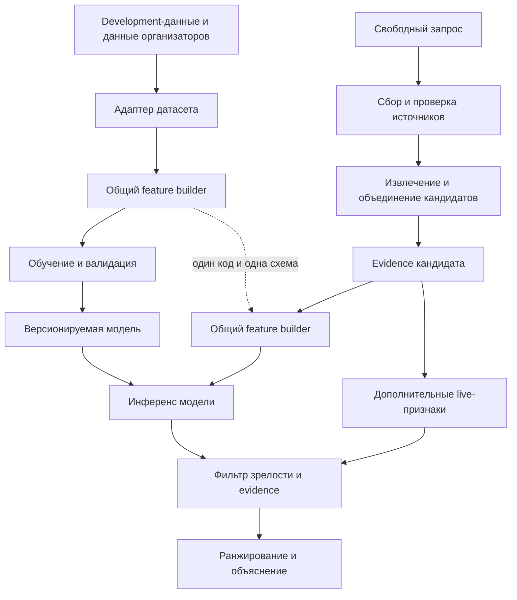

# Архитектура

## Основные решения

1. Модель классифицирует технологического кандидата, а не отдельную статью.
2. Обучение и онлайн-инференс используют один версионируемый контракт признаков.
3. Извлечение проверяемых фактов предшествует модельному скорингу.
4. Классификатор, фильтр зрелости и алгоритм ранжирования решают разные задачи.
5. Отсутствующее основание остаётся неизвестным и не превращается в новизну.
6. Каждый важный тезис связан с источником или явно обозначен как аналитическая гипотеза.

## Два связанных контура

Между извлечением сущностей и инференсом добавлены формирование кандидата и построение признаков. Благодаря этому несколько статей об одной технологии не превращаются в несколько независимых предсказаний.

## Основные контракты

### Evidence

Одно подтверждаемое наблюдение:

- устойчивый идентификатор;
- название и URL;
- дата публикации и время получения;
- тип источника и язык оригинала;
- уровень доверенности;
- релевантный фрагмент или locator;
- отметка об автоматическом переводе или резюме.

### Candidate

Нормализованный технологический объект:

- устойчивый идентификатор;
- каноническое название и aliases;
- запрос и область;
- связанные evidence-записи;
- найденные организации и участники;
- дата среза и версия оценки.

### Feature vector

Признаки уровня кандидата, воспроизводимые при обучении и инференсе:

- стадия развития;
- динамика публикаций и патентов при наличии сопоставимых данных;
- число независимых источников;
- разнообразие типов источников;
- число независимых участников;
- свежесть evidence;
- наличие массового внедрения;
- наличие сформированного рынка;
- статус отраслевого стандарта;
- доля рекламных и низкодоверенных материалов;
- текстовое представление технологии и фактического описания.

В обучаемую модель входит только пересечение воспроизводимых офлайн- и онлайн-признаков. Дополнительные сведения открытого поиска могут использоваться фильтром и ranker без скрытого изменения входа модели.

### Assessment

Машинный результат содержит:

- model score;
- признак калибровки;
- статус **main**, **watchlist** или **excluded**;
- причину исключения;
- приоритет допущенного кандидата;
- вклады признаков;
- краткое объяснение;
- ссылки на evidence;
- версии модели и feature builder.

## Работа с датасетом

После нормализации в модель могут поступать название технологии, область и фактические признаки, доступные до решения. По умолчанию исключаются:

- номер строки и произвольный идентификатор;
- итоговый ручной балл;
- текст, специально написанный как объяснение слабого сигнала;
- поля, сформированные после принятия целевого решения.

Это предотвращает target leakage и различие между признаками на обучении и в рабочей системе. Если организаторы назначат полю другую формальную роль, решение фиксируется до переобучения.

Evaluation-набор организаторов и development-набор команды имеют разные manifests и происхождение меток. Результат закрытой проверки не подменяется внутренней cross-validation.

## Модель

Квалификационная версия использует CPU-first подход:

1. Детерминированный rule-based baseline на основе зафиксированной методологии.
2. Регуляризованная Logistic Regression на структурированных и компактных текстовых признаках.
3. CatBoost только при измеримом улучшении на том же протоколе валидации.

Обучение большой языковой модели и глобальная кластеризация HDBSCAN не входят в критический путь MVP v1. Кандидаты объединяются через нормализацию, aliases, текстовую близость и отдельную обработку неоднозначных совпадений.

При валидации связанные технологии и aliases объединяются в группы. Отчёт содержит Accuracy, Precision, Recall, F1, confusion matrix, схему разбиения и фактический размер выборки. Коэффициенты или SHAP объясняют вклад модели, а фрагменты источников подтверждают фактические основания.

## Подбор источников

Обработка источников состоит из двух уровней:

1. **Фильтрация документов:** релевантность запросу, доверенность, наличие даты, первичность и дубли.
2. **Отбор evidence:** покрытие разных тезисов, независимость организаций и разнообразие типов источников.

Несколько пересказов одного анонса считаются одним исходным утверждением. Низкодоверенный источник может помочь обнаружить кандидата, но требует подтверждения или явного понижения уверенности.

## Принятие решения

Классификатор оценивает сходство наблюдаемого кандидата с development-примерами слабых сигналов. Сам по себе score не определяет основной список.

Фильтр проверяет:

- соответствие запросу;
- достаточность и качество evidence;
- массовое внедрение;
- сформированный рынок и устойчивых лидеров;
- отраслевой стандарт;
- неподтверждённый маркетинговый материал или дублирование.

Ranker сортирует прошедших кандидатов по model score, качеству оснований, признакам ранней стадии и потенциальной значимости. Результат означает порядок исследования, а не прогноз успеха.

## Компоненты и владельцы

| Компонент | Основной владелец |
| --- | --- |
| Адаптер датасета, метки, признаки, модель и оценка | ML Engineer |
| Извлечение кандидатов, entity resolution, фильтр и ranker | ML Engineer |
| Коннекторы и хранение источников | Software Engineer, проверка правил — ML Engineer |
| Jobs, API, PostgreSQL, интерфейс и развёртывание | Software Engineer |
| Общие схемы, интеграция и выпуск | Команда |

## Среда выполнения

Квалификационная версия строится как модульный Python-проект. FastAPI задаёт границу сервиса, PostgreSQL хранит исходные материалы и результаты, Docker Compose обеспечивает воспроизводимое развёртывание. Для промежуточной сдачи достаточно базового интерфейса.

Тяжёлый сбор запускается как ограниченный job. Коннекторы имеют timeout, ошибки изолируются, повторные материалы дедуплицируются, а готовый результат хранит точные версии данных, признаков и модели.
