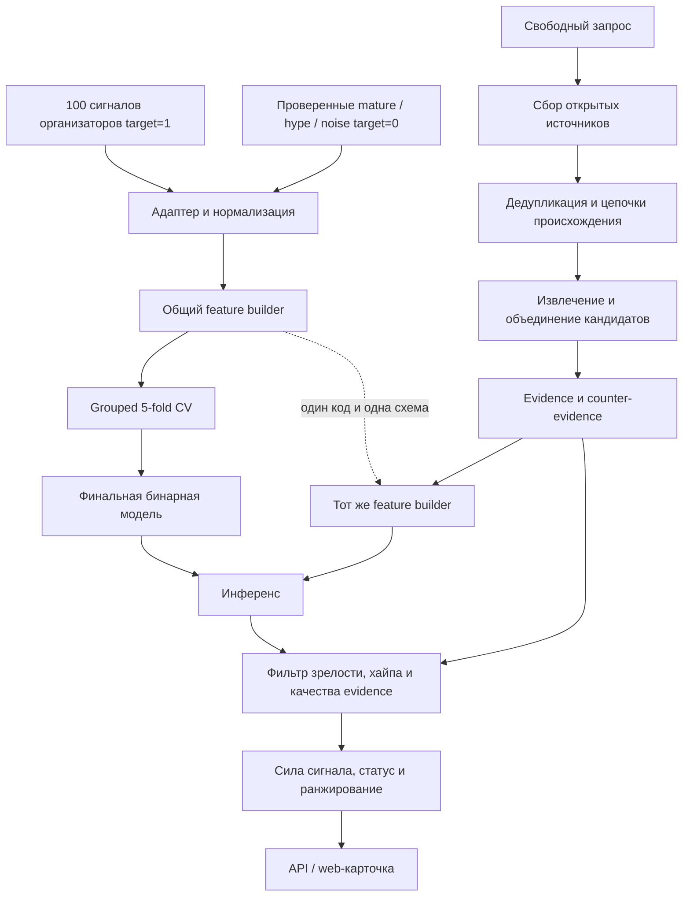

# Архитектура

## Основные решения

1. Классифицируется технологический кандидат, а не отдельный документ.
2. Обучение и онлайн-инференс используют один версионируемый feature builder.
3. 100 строк организаторов образуют положительный класс; отрицательный класс собирает команда.
4. Бинарная классификация, сила сигнала и приоритет исследования являются разными выходами.
5. Evidence и counter-evidence извлекаются до итогового решения.
6. Независимость источников оценивается по происхождению, а не по числу URL.
7. Неизвестное значение остаётся неизвестным и не доказывает новизну.
8. Каждый важный вывод связан с источником или помечен как аналитическая гипотеза.

Итоговый слой использует метод **Evidence Duel**: `signal case` агрегирует основания раннего появления, `skeptic case` — признаки зрелости, хайпа, шума и зависимости источников. Decision policy сопоставляет обе стороны и формирует статус с объяснением.

## Поток данных

## Контракты

### SourceDocument

Исходный материал хранит:

- устойчивый идентификатор;
- название, URL и canonical URL;
- дату публикации и время получения;
- тип источника и язык;
- организацию-издателя и предполагаемый первоисточник;
- уровень доверенности;
- исходный текст или доступный фрагмент;
- признаки автоматического перевода и резюме.

### Evidence

Evidence — одно проверяемое утверждение из документа:

- тип тезиса: стадия, рост, патент, пилот, инвестиция, внедрение, стандарт или рынок;
- значение и релевантный фрагмент;
- locator в документе;
- дата, организация и источник;
- направление: `support` или `counter`;
- уверенность извлечения.

### Candidate

Нормализованный объект:

- каноническое название и aliases;
- запрос и область применения;
- связанные документы и evidence;
- найденные организации;
- `group_id` и цепочки происхождения;
- дата среза и версия оценки.

### FeatureVector

Признаки сгруппированы по смыслу:

| Группа | Примеры |
| --- | --- |
| Новизна | возраст термина, новая комбинация, отличие от известных aliases |
| Рост | изменение числа независимых наблюдений между сопоставимыми окнами, burst |
| Связность | повторяемость терминологии, число независимых организаций, устойчивость темы |
| Evidence | число первоисточников, разнообразие типов, свежесть, доверенность |
| Ранняя стадия | исследование, прототип, патент, пилот, ограниченное внедрение |
| Контраргументы | массовое внедрение, сформированный рынок, стандарт, рекламная доля |
| Информационное эхо | число копий на один origin, текстовая близость, зависимость организаций |
| Текст | компактное представление названия и фактического описания |

В обучаемую модель входит только пересечение признаков, воспроизводимых для организаторских строк, отрицательного корпуса и нового кандидата. Дополнительные live-признаки допускаются в прозрачном фильтре или ranker, но не меняют скрыто вход бинарной модели.

### Assessment

Результат содержит три разные оценки:

- `model_score` — выход бинарного классификатора;
- `signal_strength` — интерпретация силы сигнала по стадии, росту и качеству evidence;
- `ranking_score` — порядок ручного исследования среди допущенных кандидатов.

Также сохраняются статус, причины исключения, вклады признаков, evidence, counter-evidence и версии данных, модели и feature builder.

## Подготовка обучающих данных

Адаптер преобразует 100 строк организаторов в положительные Candidate-записи и фиксирует исходное происхождение. Ручной балл и готовое обоснование исключаются из входа бинарного классификатора.

Отрицательные примеры проходят отдельный review. Подтипы `mature`, `marketing_hype` и `noise` сворачиваются в target `0`, но сохраняются для анализа ошибок. Черновики и synthetic fixtures не обучают модель.

Одинаковые или связанные технологии получают общий `group_id`. Это предотвращает ситуацию, когда почти одинаковое название находится и в train, и в validation.

## Модель и оценка

Последовательность экспериментов для MVP:

1. majority baseline;
2. зафиксированный rule-based baseline;
3. регуляризованная Logistic Regression на структурированных и компактных текстовых признаках;
4. CatBoost на структурированных признаках только при измеримом улучшении.

При малой выборке сложная нейросетевая модель не входит в критический путь. Предобученное текстовое представление может использоваться как фиксированный признак, но его версия сохраняется, а качество сравнивается с простым TF-IDF baseline.

Все варианты проверяются на одинаковом grouped 5-fold protocol. Для каждого кандидата сохраняется ровно одно out-of-fold предсказание, из которых строятся общие метрики и confusion matrix. После выбора модели она переобучается на всех проверенных строках.

Дополнительная оценка `3–7` реализуется отдельно. Первый baseline воспроизводит прозрачную rubric по стадии, росту и evidence. ML-регрессия или ordinal model добавляется только если она улучшает ошибку при cross-validation и не использует исходный балл или готовое обоснование как вход.

## Открытый поиск

Онлайн-контур разделяет discovery и verification:

1. широкий поиск находит возможные названия и материалы;
2. нормализация объединяет aliases;
3. проверочный поиск собирает первичные основания и контраргументы по каждому кандидату;
4. дедупликация объединяет перепечатки в одну цепочку происхождения;
5. feature builder строит модельные признаки;
6. фильтр применяет явные правила качества evidence и зрелости;
7. ranker сортирует только допущенных кандидатов.

Низкодоверенный материал может помочь discovery, но не должен единолично переводить кандидата в `main`.

## Фильтр и статусы

Фильтр проверяет:

- релевантность запросу;
- минимальное качество evidence;
- независимость организаций и первоисточников;
- массовое внедрение и сформированный рынок;
- отраслевой стандарт;
- долю рекламных или зависимых материалов;
- противоречие между сильным ростом упоминаний и отсутствием технических оснований.

Критический признак зрелости переводит кандидата в `excluded`. Недостаточность данных переводит его в `watchlist`. Остальные кандидаты могут получить `main` и участвовать в ранжировании.

## Границы LLM

LLM может:

- извлекать структурированные утверждения;
- предлагать aliases;
- переводить и сокращать текст;
- формулировать объяснение из сохранённых фактов.

LLM не является единственным источником факта, даты, ссылки, метрики или итогового класса. Сгенерированное объяснение проверяется против сохранённых значений и не добавляет новых утверждений.

## Компоненты и владельцы

| Компонент | Основной владелец |
| --- | --- |
| Адаптер, данные, признаки, модель и оценка | ML Engineer |
| Извлечение кандидатов, aliases, фильтр и ranker | ML Engineer |
| Коннекторы, provenance и хранение | Software Engineer; правила проверяет ML Engineer |
| Jobs, API, PostgreSQL, интерфейс и развёртывание | Software Engineer |
| Контракты, конкурентная методология и выпуск | Команда |

## Среда выполнения

Python-пакет содержит бизнес-логику, FastAPI задаёт границу сервиса, PostgreSQL хранит документы, evidence, кандидатов и оценки, Docker Compose обеспечивает воспроизводимый запуск. Тяжёлый сбор выполняется как ограниченный job; коннекторы имеют timeout, retry, дедупликацию и изоляцию ошибок.
