# NextWave

NextWave ищет ранние научно-технологические тренды по свободному запросу. Система собирает публикации и отраслевые материалы из открытых источников, выделяет технологии-кандидаты, оценивает их моделью и показывает проверяемые аргументы за и против статуса слабого сигнала.

Проект создан для кейса Газпромбанк.Тех на международном хакатоне 2026 года.

## Быстрый просмотр

Нужен Docker Desktop с запущенным Linux Engine:

```bash
docker compose up --build -d
```

После запуска:

- web-интерфейс: <http://localhost:8080>;
- API и Swagger: <http://localhost:8000/docs>;
- healthcheck: <http://localhost:8000/api/health>.

По умолчанию открывается сохранённый результат реального анализа. Для его просмотра не нужны API-ключи и внешняя сеть. Остановка: `docker compose down`. Настройка live-режима, порты и диагностика описаны в [DOCKER.md](docs/DOCKER.md).

## Что получает пользователь

Пользователь вводит технологическое направление в свободной форме. NextWave выполняет поиск вне обучающего датасета и возвращает:

- ранжированный ТОП-15 слабых сигналов;
- отдельные списки тем для наблюдения и исключённых кандидатов;
- название и русскоязычное описание технологии;
- скор модели и признаки, повысившие или понизившие оценку;
- несколько аргументов, почему тема похожа на слабый сигнал;
- контраргументы о зрелости, маркетинговом хайпе или недостатке подтверждений;
- ссылки на источники, название, дату, тип, язык и уровень доверия;
- количество проверенных кандидатов, документов и независимых источников.

Зарубежные материалы сохраняют оригинальные название и цитату. Русская интерпретация явно отмечается как автоматически сформированная.

## Как работает анализ

```mermaid
flowchart LR
    Q[Свободный запрос] --> R[Query Resolver]
    R --> D[OpenAlex и открытый web-поиск]
    D --> G[Candidate Gate]
    G --> A[Aliases и дедупликация]
    A --> E[OpenAlex + Exa enrichment]
    E --> F[Временные и структурные признаки]
    F --> M[Интерпретируемая Logistic Regression]
    M --> V[Evidence Duel]
    V --> P[main / watchlist / excluded]
    P --> U[ТОП-15 и отчёты]
```



Модель отвечает на вопрос, похож ли кандидат по измеренным признакам на слабый сигнал. Evidence Duel отдельно проверяет, подтверждают ли источники раннюю стадию и нет ли признаков зрелого рынка, массового внедрения или рекламного шума. Языковая модель извлекает утверждения из уже найденных документов, но не подменяет поиск и не принимает финальное решение самостоятельно.

Полная логика, признаки, ранжирование и уровни доверия описаны в [METHODOLOGY.md](docs/METHODOLOGY.md).

## Результаты модели

Основная внутренняя оценка выполнена как детерминированная stratified grouped 5-fold cross-validation. Группировка не позволяет вариантам одной технологии оказаться одновременно в train и test.

| Метрика | Значение |
|---|---:|
| Accuracy | 0.915 |
| Precision | 0.891 |
| Recall | 0.980 |
| F1-score | 0.933 |
| Balanced accuracy | 0.896 |

Это превышает требование 75–80% на внутренней проверке. Метрики не выдаются за результат на скрытой выборке организаторов: предоставленные положительные примеры дополнены самостоятельно собранными и проверенными отрицательными примерами. Метод оценки, confusion matrix, срезы по областям и ограничения приведены в [MODEL_REPORT.md](docs/MODEL_REPORT.md). Машиночитаемый отчёт находится в [`demo/model/metrics.json`](demo/model/metrics.json).

## Соответствие промежуточному ТЗ

| Требование | Реализация |
|---|---|
| Очистка и подготовка данных | `src/nextwave/datasets`, валидируемые JSONL и manifest с SHA-256 |
| Обучение модели | `src/nextwave/modeling`, воспроизводимый grouped CV и frozen model |
| Precision, Recall, F1, Accuracy | [MODEL_REPORT.md](docs/MODEL_REPORT.md), `demo/model/metrics.json` |
| Методология слабого сигнала | [METHODOLOGY.md](docs/METHODOLOGY.md) |
| Свободный открытый запрос | `POST /api/analyses`, форма на главной странице |
| Поиск вне стартового датасета | OpenAlex и Exa; кандидаты извлекаются заново для каждого запроса |
| Сбор и обработка источников | `src/nextwave/sources`, resumable snapshots и provenance |
| Ранжированная выдача | ТОП-15, наблюдение и исключённые кандидаты в web и API |
| Скор и объяснение | model score, локальные вклады признаков, Evidence Duel |
| Проверяемые источники | название, URL, дата, тип, язык, trust tier и точная цитата |

## Структура репозитория

```text
backend/                 FastAPI, PostgreSQL и analysis jobs
frontend/                React-интерфейс
src/nextwave/
  datasets/              очистка и проверка датасета
  discovery/             открытый поиск и извлечение кандидатов
  sources/               коннекторы OpenAlex, Exa и snapshots
  modeling/              признаки, обучение и интерпретация модели
  evaluation/            Evidence Duel, policy и единый результат
demo/model/              воспроизводимый отчёт и frozen model
demo/result/             сохранённый результат реального запроса
tests/                   офлайн-тесты без реальных API-вызовов
```

Основные документы:

- [METHODOLOGY.md](docs/METHODOLOGY.md) — как система определяет слабый сигнал;
- [MODEL_REPORT.md](docs/MODEL_REPORT.md) — оценка модели;
- [REVIEW_GUIDE.md](docs/REVIEW_GUIDE.md) — маршрут проверки за 5–10 минут;
- [ARCHITECTURE.md](docs/ARCHITECTURE.md) — техническая архитектура и контракты;
- [DOCKER.md](docs/DOCKER.md) — запуск и настройка окружения;
- [LABELING.md](docs/LABELING.md) — разметка отрицательных классов;
- [REQUIREMENTS.md](docs/REQUIREMENTS.md) — формальные инварианты данных и модели.

## API

```text
POST /api/analyses             создать анализ
GET  /api/analyses/{id}        получить стадию и прогресс
GET  /api/analyses/{id}/result получить единый результат
GET  /api/health               проверить сервис
```

Backend хранит задачи и результаты в PostgreSQL. Повторный запуск продолжает анализ с проверенных checkpoint-артефактов и не выполняет завершённые стадии заново.

## Локальная разработка

```powershell
py -3.13 -m venv .venv
.\.venv\Scripts\Activate.ps1
python -m pip install --upgrade pip
python -m pip install -e .
python -m unittest discover -s tests -q
python -m nextwave --version
```

Frontend и backend проверяются отдельно:

```powershell
cd frontend
npm ci
npm run lint
npm run build

cd ..\backend
python -m pip install -r requirements.txt
python -m pytest -q
```

## Live-режим и секреты

Проверенный snapshot включён в репозиторий для воспроизводимой демонстрации. Live-режим запускает полный конвейер для нового запроса:

```powershell
python -m nextwave analysis-run `
  --query "Инфраструктурные технологии для ИИ" `
  --analysis-id analysis-demo-001 `
  --workspace runtime/analysis-jobs/analysis-demo-001
```

Используется одна раскрытая облачная модель из списка ТЗ: `GPT-5.6 Luna` (`gpt-5.6-luna`) через официальный OpenAI API. Автоматического routing и скрытого fallback нет. OpenAlex и Exa отвечают за поиск; LLM используется для структурированного извлечения и анализа найденного текста.

Ключи задаются только в локальном `.env`:

```dotenv
NEXTWAVE_OPENAI_API_KEY=
NEXTWAVE_OPENALEX_API_KEY=
NEXTWAVE_OPENALEX_MAILTO=
NEXTWAVE_EXA_API_KEY=
```

`.env`, сырые данные, runtime-артефакты и локальная БД исключены из Git. Ключи не включаются в URL, prompts, snapshots, manifests, результаты или frontend.
