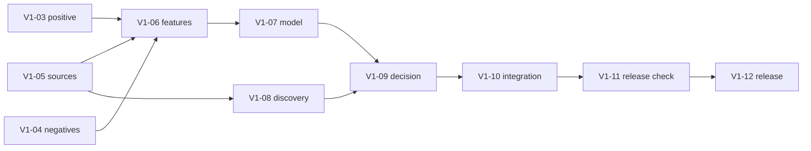

# План работ

## Цель

К 29 сентября 2026 года подготовить воспроизводимый квалификационный MVP, который показывает внутреннюю Accuracy не ниже 80%, выполняет живой поиск по открытым источникам и формирует проверяемый ТОП-15.

Конкурентная демонстрация состоит из трёх связанных элементов:

- Evidence Duel показывает доказательства раннего сигнала и контраргументы;
- anti-echo объединяет зависимые публикации вокруг первоисточника;
- исторический срез доказывает, что решение не использовало будущие сведения.

## Бэклог MVP v1

| ID | Задача | Срок | Проверяемый результат | Ветка |
| --- | --- | --- | --- | --- |
| V1-01 | Основа репозитория и доменные контракты | готово | Пакет устанавливается, контракты и базовые тесты проходят | `docs/v1-01-project-base` |
| V1-02 | Демонстрационный web/API-каркас и Docker | готово | Синтетический интерфейс запускается и явно обозначает тип данных | `feat/v1-02-web-app` |
| V1-03 | Адаптер положительного класса | готово | 100 строк получают target `1`, общий cutoff и manifest; экспертные поля отделены | `feat/v1-03-dataset` |
| V1-04 | Разметка отрицательных и шумовых контролей | 20 сен | Проверены минимум 50 mature, 50 hype и 50 noise; области и источники сбалансированы | `feat/v1-04-labels` |
| V1-05 | Коннекторы и snapshots | 21 сен | OpenAlex, Crossref и информационный коннектор сохраняют реальные ответы, метаданные и ошибки | `feat/v1-05-sources` |
| V1-06 | Историческое обогащение и feature builder | 23 сен | Оба класса и online fixtures получают одну схему; окна и unknown проверены | `feat/v1-06-features` |
| V1-07 | Candidate gate и модель | 24 сен | Шум оценивается отдельно; grouped 5-fold отчёт содержит метрики, ошибки и области | `feat/v1-07-model` |
| V1-08 | Discovery, aliases и anti-echo | 25 сен | Свободный запрос создаёт новых кандидатов; origin groups и aliases воспроизводимы | `feat/v1-08-discovery` |
| V1-09 | Evidence Duel и исторический срез | 26 сен | Контрольные early, mature, hype, noise и historical сценарии получают ожидаемые статусы | `feat/v1-09-decision` |
| V1-10 | PostgreSQL и интеграция API/UI | 27 сен | Реальный запрос проходит от коннекторов до русскоязычной карточки и причин исключения | `feat/v1-10-integration` |
| V1-11 | Развёртывание и репетиция | 28 сен | Чистый Docker-запуск, полный ТОП-15, частичный отказ и резервный snapshot проверены | `chore/v1-11-release-check` |
| V1-12 | Квалификационный релиз | 29 сен | Commit, данные, модель, отчёт, snapshot и инструкция относятся к одной версии | `release/v1-qualification` |

## Зависимости

V1-03, V1-04 и V1-05 можно выполнять параллельно разными участниками. Схема feature vector фиксируется до обучения модели. Формат production API фиксируется после V1-09, когда определены реальные выходы Evidence Duel.

## Контрольные точки

| Дата | Результат |
| --- | --- |
| 18 сен | 100 положительных строк готовы к общему обогащению |
| 20 сен | Минимальный отрицательный корпус и шумовые контроли проверены |
| 21 сен | Реальные источники сохраняют snapshots и метаданные |
| 23 сен | Исторические признаки воспроизводятся для обоих классов |
| 24 сен | Получен честный grouped CV-отчёт и результат candidate gate |
| 26 сен | Работают Evidence Duel, anti-echo и исторический срез |
| 27 сен | Реальный сквозной запрос отображается в web-интерфейсе |
| 28 сен | Проведена репетиция live-demo и резервного сценария |
| 29 сен | Выпущена квалификационная версия |

## Правила сокращения объёма

При отставании исключаются:

1. модели сложнее Logistic Regression;
2. дополнительные источники после обязательных коннекторов;
3. декоративные элементы интерфейса;
4. автоматическая патентная аналитика;
5. дополнительные исторические кейсы;
6. второстепенные графики.

Не исключаются:

- 100 положительных и проверенный отрицательный корпус;
- общий feature builder;
- реальный открытый запрос;
- происхождение документов и anti-echo;
- фильтр зрелости и Evidence Duel;
- один исторический срез;
- ТОП-15 на демонстрационном запросе;
- чистое развёртывание и отчёт метрик.

После 26 сентября не добавляются новые семейства моделей, обязательные источники или крупные части интерфейса.

## Основные риски

| Риск | Ранний сигнал | Действие |
| --- | --- | --- |
| Недостаточно проверенных отрицательных примеров | К 19 сентября проверено меньше 60 записей | Сократить необязательный UI и завершить по 50 mature/hype |
| Источники дают несопоставимую историю | Окна часто получают `unknown` | Оставить один количественный источник и не смешивать ряды |
| Модель учит происхождение классов | Высокая CV-метрика падает по отдельным областям | Сопоставить классы по областям, cutoff и покрытию; проверить stress-test |
| Live-поиск нестабилен | Частые timeout или 429 | Кэш, ограничение запросов, backoff и резервный сохранённый snapshot |
| ТОП-15 не формируется | После фильтра остаётся меньше 15 кандидатов | Увеличить discovery pool и заранее проверить демонстрационный запрос |
| Объяснение не подтверждается | Claim нельзя связать с фрагментом | Исключить claim из решения и показать его как неизвестный |

## После квалификации

Следующая версия добавляет патентный коннектор, несколько исторических срезов, калибровку модели, расширенный анализ ошибок, граф технологической траектории, мониторинг обновлений, финальный стенд и презентацию.
