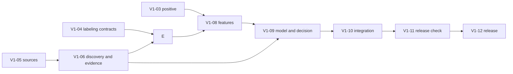

# План работ

## Цель

К 29 сентября 2026 года подготовить воспроизводимый квалификационный MVP, который показывает внутреннюю Accuracy не ниже 80%, выполняет живой поиск по открытым источникам и формирует проверяемый ТОП-15.

Конкурентная демонстрация состоит из трёх связанных элементов:

- Evidence Duel показывает доказательства раннего сигнала и контраргументы;
- anti-echo объединяет зависимые публикации вокруг первоисточника;
- исторический срез доказывает, что решение не использовало будущие сведения.

## Бэклог MVP v1

| ID | Задача | Срок | Проверяемый результат | Ветка |
| --- | --- | --- | --- | --- |
| V1-01 | Основа репозитория и доменные контракты | готово | Пакет устанавливается, контракты и базовые тесты проходят | `docs/v1-01-project-base` |
| V1-02 | Демонстрационный web/API-каркас и Docker | готово | Синтетический интерфейс запускается и явно обозначает тип данных | `feat/v1-02-web-app` |
| V1-03 | Адаптер положительного класса | готово | 100 строк получают target `1`, общий cutoff и manifest; экспертные поля отделены | `feat/v1-03-dataset` |
| V1-04 | Протокол разметки и review-контракты | готово | Зафиксированы классы, квоты, контракты и формат проверки автоматических предложений | `feat/v1-04-labels` |
| V1-05 | Коннекторы и snapshots | 21 сен | Обязательный OpenAlex, точечный Crossref, вспомогательный Media Cloud и резервный GDELT сохраняют ответы, метаданные и ошибки; частичный отказ не подменяется нулём | `feat/v1-05-sources` |
| V1-06 | Discovery, входной Candidate gate, aliases, anti-echo и извлечение evidence | 23 сен | Ограниченный live-поиск объединяет свежие и сохранённые документы; входной фильтр проверяет релевантность и конкретность предложений, сохраняет причины решений и передаёт кандидатов на проверочный поиск, формирование aliases, origin groups и предварительных evidence | `feat/v1-06-discovery` |
| V1-07 | Проверенный отрицательный корпус | 24 сен | Из сохранённых предложений, исключений и ошибок discovery сформирована очередь review; при нехватке классов выполнен целевой поиск; проверены минимум 50 mature, 50 hype и 50 noise с балансом областей и источников | `feat/v1-07-labels` |
| V1-08 | Историческое обогащение и feature builder | 25 сен | Оба класса получают одну схему; временные окна, unknown и утечка по времени проверены | `feat/v1-08-features` |
| V1-09 | Модель, оценка Candidate gate и Evidence Duel | 26 сен | Grouped 5-fold отчёт, измерено качество входного фильтра и проверены контрольные early, mature, hype, noise, historical сценарии | `feat/v1-09-model` |
| V1-10 | PostgreSQL и интеграция API/UI | 27 сен | PostgreSQL хранит накопленные результаты запусков; реальный запрос проходит от live-коннекторов до ТОП-15, карточек и причин исключения | `feat/v1-10-integration` |
| V1-11 | Развёртывание и репетиция | 28 сен | Чистый Docker-запуск, полный ТОП-15, частичный отказ и резервный snapshot проверены | `chore/v1-11-release-check` |
| V1-12 | Квалификационный релиз | 29 сен | Commit, данные, модель, отчёт, snapshot и инструкция относятся к одной версии | `release/v1-qualification` |

## Зависимости

Порядок рассчитан на последовательную работу одного разработчика. Входной Candidate gate относится к V1-06: без проверки конкретности и релевантности предложения нельзя направить на проверочный поиск и сбор evidence. В V1-09 качество этого фильтра измеряется на проверенном корпусе и при необходимости корректируется; это не переносит сам входной фильтр на этап обучения модели. Ручная проверка корпуса начинается после V1-06: конвейер уже должен предложить кандидатов, evidence и поисковое покрытие. Схема feature vector фиксируется до обучения модели. Формат production API фиксируется после V1-09, когда определены реальные выходы Evidence Duel.

## Зафиксированный критический путь 27–29 сентября

До готовности ядра работы над реальным API, PostgreSQL и интерфейсом приостановлены. Порядок больше не меняется:

1. Финализировать разметку: bundle и книга сверяются, в корпус попадают только `reviewed`/`adjudicated` решения с `verified` evidence; квоты, области и 20% повторной проверки проверяются кодом.
2. Очистить текущую сотню от общих понятий, ошибок извлечения и межобластных дублей; заменить их кандидатами из сохранённого overflow до любых новых API-запросов.
3. Выполнить одинаковое кандидатское enrichment для отрицательных примеров. `marketing_hype` требует полного scientific/industry-покрытия конкретного кандидата, а не покрытия исходного discovery-запуска.
4. Получить и проверить ровно 50 `mature`, 50 `marketing_hype` и 50 noise. Дефицит класса или области закрывается заменой из резерва, а не принудительной меткой.
5. Разрешить aliases и близкие дубли между positive/negative/new и присвоить общий group identity для grouped CV.
6. Усилить anti-echo: предложения о перепечатках проходят проверяемое объединение; `exact_origin_count` не трактуется как число независимых подтверждений без такого решения.
7. Построить один feature builder для positive, negative и live-кандидатов. Количественная динамика считается по отдельным OpenAlex count-запросам candidate×window и scope×window; capped retrieval counts не являются признаком.
8. Обучить Logistic Regression и baselines с grouped stratified 5-fold: OOF-метрики, порог внутри fold, классы/области, leave-one-domain-out и отчёт ошибок. Media Cloud входит в признаки только после ablation.
9. Собрать сначала CLI-решение `discovery → features → model → maturity policy → main/watchlist/excluded → TOP-15 → Evidence Duel` и проверить один исторический срез без будущих документов.
10. Только после стабильного итогового JSON подключить backend/frontend/PostgreSQL/Docker, измерить полный live-прогон против лимита 20 минут и синхронизировать README, Docker-инструкцию и релизные manifests.

Текущая точка на 28.09.2026: claim-specific audit v6 проверил 114 старых и новых
hype-вариантов и принял 6; дефицит равен 44. Audit v4/v5 ошибочно считал любое
научное совпадение независимой технической валидацией и приравнивал launch/demo
к подтверждённому пилоту. Исправленная рубрика проверяет конкретное рекламное
обещание: упоминание, обзор, релиз и лабораторное demo сами по себе hype не
блокируют. Все три широких пакета завершены; новые поисковые пакеты остановлены,
чтобы не сорвать остальные обязательные блоки. Noise содержит 50 строк.
Development feature table v3 отражает старые статусы и честно исключает proposed
и содержит 164 строки; scoped OpenAlex counts v4 завершены 412/412. Diagnostic
LogReg report v4 даёт OOF accuracy 0.909 и balanced accuracy 0.891, сохраняет
15 OOF-ошибок и явные FPR по отрицательным подтипам, но эти метрики нельзя
выдавать за qualification. Блокеры: дефицит 44 hype, frozen roster 50/50 и
reviewed identity. Второй широкий пакет также дал 0 hype: 14 not-grounded, один
Gate reject и пять с недостаточной publicity. Temporal v3 запрещён: независимые candidate/scope
запросы дали 23 доли больше единицы. Автоматические EvidenceClaim не считаются
экспертными метками и не заменяют проверенный отрицательный корпус.

До релиза не создаётся глобальный локальный индекс по заранее придуманным темам. V1-06 выполняет query-time discovery через внешние индексы, повторно использует накопленные документы и при каждом новом анализе проверяет свежие данные. Crossref вызывается только для точечного обогащения DOI, а информационный провайдер остаётся заменяемым и не блокирует основной научный контур.

## Контрольные точки

| Дата | Результат |
| --- | --- |
| 18 сен | 100 положительных строк готовы к общему обогащению |
| 20 сен | Готовы правила разметки, контракты и формат экспертной проверки |
| 21 сен | Реальные источники сохраняют snapshots и метаданные |
| 23 сен | Запрос автоматически создаёт кандидатов, origin groups и evidence |
| 24 сен | Отрицательный корпус и шумовые контроли проверены человеком |
| 25 сен | Исторические признаки воспроизводятся для обоих классов |
| 26 сен | Получен grouped CV-отчёт; измерено качество входного Candidate gate, работают Evidence Duel и исторический срез |
| 27 сен | Реальный сквозной запрос отображается в web-интерфейсе |
| 28 сен | Проведена репетиция live-demo и резервного сценария |
| 29 сен | Выпущена квалификационная версия |

## Правила сокращения объёма

При отставании исключаются:

1. модели сложнее Logistic Regression;
2. дополнительные источники после обязательных коннекторов;
3. декоративные элементы интерфейса;
4. автоматическая патентная аналитика;
5. дополнительные исторические кейсы;
6. второстепенные графики.

Не исключаются:

- 100 положительных и проверенный отрицательный корпус;
- общий feature builder;
- реальный открытый запрос;
- происхождение документов и anti-echo;
- фильтр зрелости и Evidence Duel;
- один исторический срез;
- ТОП-15 на демонстрационном запросе;
- чистое развёртывание и отчёт метрик.

После 26 сентября не добавляются новые семейства моделей, обязательные источники или крупные части интерфейса.

## Основные риски

| Риск | Ранний сигнал | Действие |
| --- | --- | --- |
| Недостаточно проверенных отрицательных примеров | К 19 сентября проверено меньше 60 записей | Сократить необязательный UI и завершить по 50 mature/hype |
| Источники дают несопоставимую историю | Окна часто получают `unknown` | Оставить один количественный источник и не смешивать ряды |
| Англоязычные новости доминируют в выдаче | Ранги заметно меняются после добавления Media Cloud | Разделить языки и каналы; проверить ablation; оставить новости только в Evidence Duel при ухудшении метрик |
| Модель учит происхождение классов | Высокая CV-метрика падает по отдельным областям | Сопоставить классы по областям, cutoff и покрытию; проверить stress-test |
| Live-поиск нестабилен | Частые timeout или 429 | Ограничение запросов, backoff, частичный результат со статусом покрытия и резервный snapshot для демонстрации |
| ТОП-15 не формируется | После фильтра остаётся меньше 15 кандидатов | Увеличить discovery pool и заранее проверить демонстрационный запрос |
| Объяснение не подтверждается | Claim нельзя связать с фрагментом | Исключить claim из решения и показать его как неизвестный |

## После квалификации

Следующая версия добавляет патентный коннектор, несколько исторических срезов, калибровку модели, расширенный анализ ошибок, граф технологической траектории, мониторинг обновлений, финальный стенд и презентацию.
